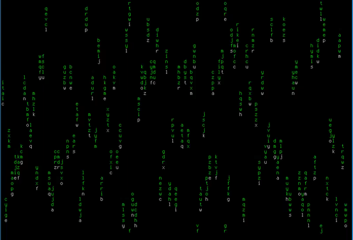

## Overview

This is my simple matrix animation on ncurses. That's all.

How it looks:



## Build

Possibly, you should install libncurses5-dev.

Just make source with ```make``` and everything should be fine.

## Customization

You can find all settings in defs.h. For example, SYMBOLS_MAX
is matroids height. MATRIX_BOARD_* is matrix field size.
You can just make a little the matrix quad 10x10 with it.

## Conclusion

I really wanted repeat matrix how in Matrix. How glad i was, when
it worked...
